# Practica-03SI

# Escenarios

En esta primera parte de la practia hemos realizado distintos escenarios para ver como se pueden llegar a comportar los objetos de una escena con **Rigidbody**, **Collider**
o siendo **Trigers**

## Escenario-1

  El plano no es un elemento físico. El cubo sí lo es, pero la esfera no. Por lo tanto, el plano y la esfera únicamente necesitan un **collider**, mientras que el cubo debe contar con un **Rigidbody**.

  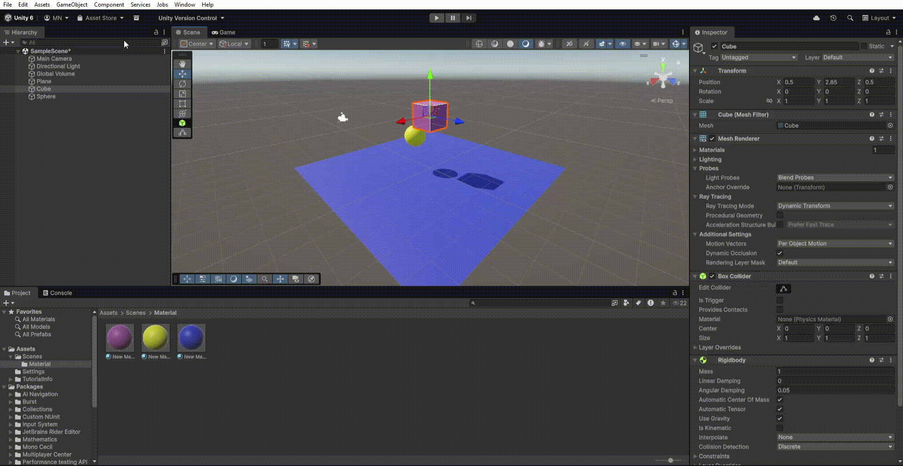

## Esceanrio-2
  El plano no es un objeto físico. El cubo es un objeto físico y la esfera también. En este caso, el plano sólo tendrán **collider**, mientras que el cubo y la esfera deben tener **Rigidbody**.

  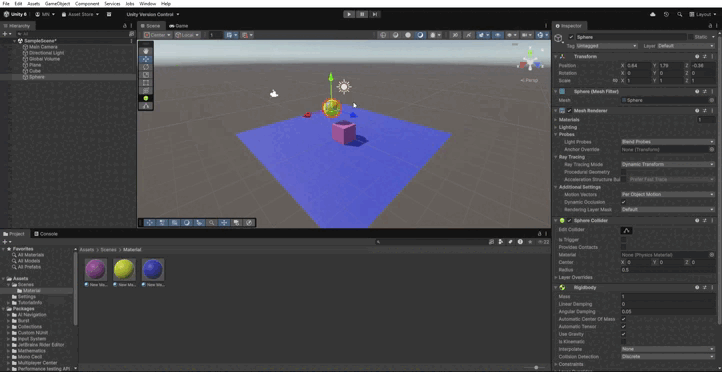

## Escenario-3
  El plano no se considera un objeto físico, mientras que el cubo sí lo es y la esfera se comporta como un objeto cinemático. Por lo tanto, el plano únicamente requiere un **collider**, mientras que tanto el cubo como la esfera deben tener un **Rigidbody**, siendo este último configurado como **cinemático**.

   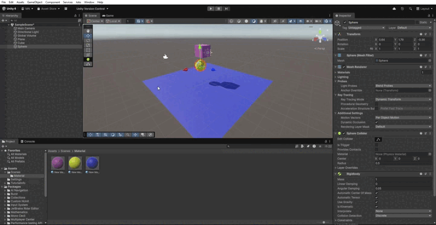

## Escenario-4
 El plano, el cubo y la esfera son objetos físicos. Por lo tanto, los tres deben contar con un Rigidbody.

 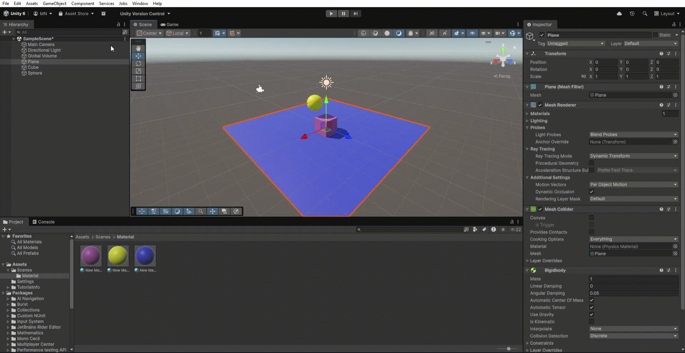

## Escenario-5
  El plano es un objeto físico. El cubo es un objeto físico y la esfera es física con 10 veces más masa que el cubo. En este caso, todos los objetos deben tener **Rigidbody**.

   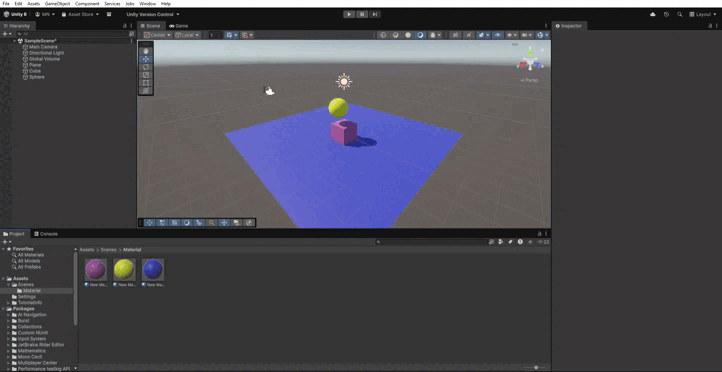

## Escenario-6
  El plano es un objeto físico. El cubo es un objeto físico y la esfera es física con 100 veces más masa que el cubo. En este caso, todos los objetos deben tener **Rigidbody**.

  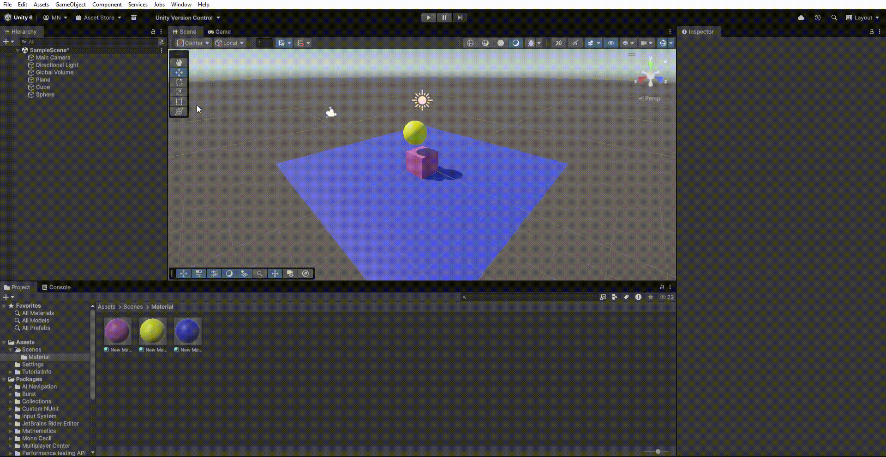

## Escenaio-7
  El plano y el cubo son objetos físicos, y la esfera también lo es, además tiene fricción. Por lo tanto, los tres objetos necesitan un **Rigidbody**.

  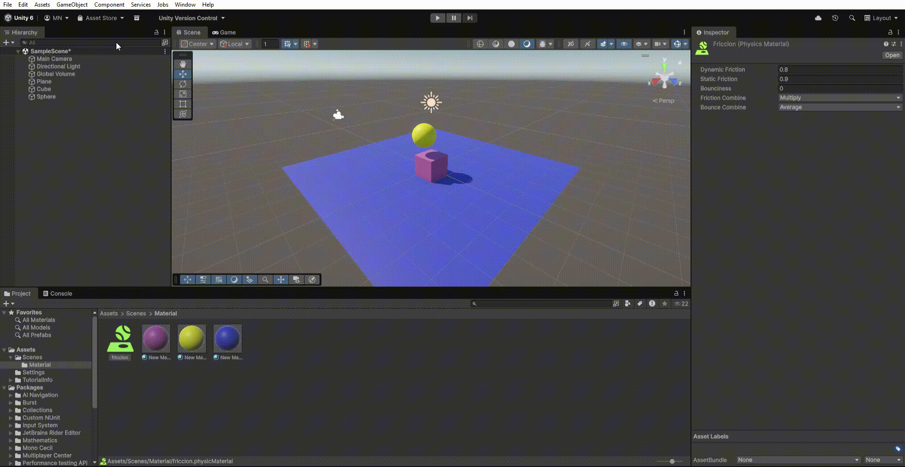

# Ejercicios

Ahora pasaremos a los distintos ejercicios que se nos piden en la practica.

## Ejercicio-1
  Creamos un personaje (en mi caso me descarge uno de la **Unity Store**) cuyo desplazamiento pueda controlarse con las teclas WASD. El movimiento esta gestionado mediante un **Rigidbody**, pero sin perder el control completo del personaje.

El script **wasd** permite controlar un personaje. Primero, obtiene el componente **Rigidbody** del personaje y bloquea su rotación para que no gire inesperadamente debido a la física. En cada actualización de frame, detecta qué teclas de movimiento se están presionando y genera un vector de dirección normalizado para asegurar que el personaje no se mueva más rápido al desplazarse en diagonal. Luego, en cada actualización de física (FixedUpdate), mueve al personaje aplicando la física del **Rigidbody**, multiplicando la dirección de movimiento por la velocidad y el tiempo fijo de actualización, lo que permite un desplazamiento suave y controlado.

  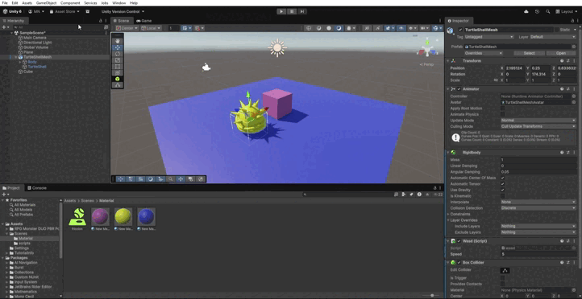

## Ejercicio-2

  En este caso creamos varios cubos o esferas con **Rigidbody** dinámico. Cada vez que colisionen con otro objeto, muestra en la consola el nombre del objeto con el que chocan y cambia su color de manera aleatoria.

  El script **cambioColor** detecta colisiones mediante el método **OnCollisionEnter**. Cuando un objeto colisiona con otro que tenga el tag **"cubo"**, se imprime en la consola un mensaje indicando el objeto con el que se produjo la colisión. Luego, obtiene el componente Renderer del objeto colisionado y cambia su color utilizando la función **GenerateRandomColor**, la cual genera un color aleatorio.  afectado.

  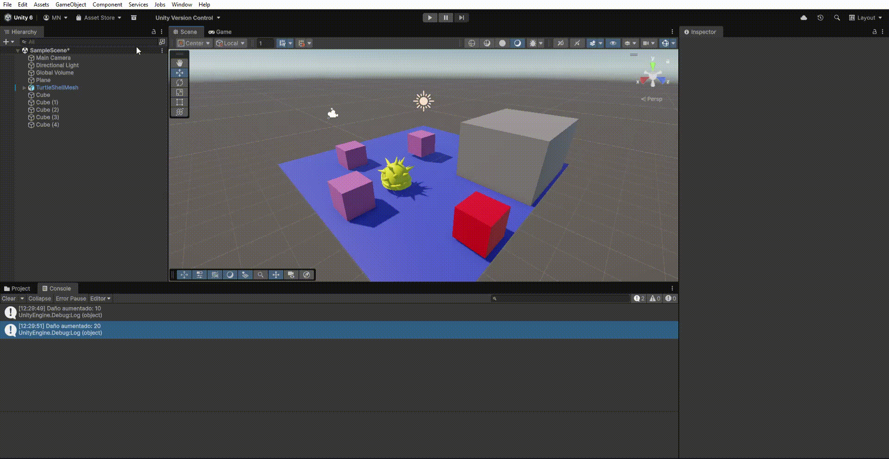

## Ejercicio-3

  Creamos un cubo grande y le activamos **Is Trigger**. Al entrar en esta zona, el personaje proboca que se  active un efecto que modifica la luz de la escena. 
  Al salir de la zona, el cambio se revierte. Además, agrega otra zona que, al entrar aumente una variable de daño del jugador.

  El script **cambiopersonaje** gestiona dos tipos de zonas mediante triggers. Primero, la zona de luz detecta si el objeto que entra tiene el tag **"CambioColor"**. Si es así, cambia el color de una luz de la escena y aumenta su intensidad, creando un efecto visual. Cuando el objeto sale de esta zona, el color y la intensidad de la luz se restauran a sus valores originales.La segunda zona, llamada zona de daño, aumenta la variable **playerDamage** cada vez que el objeto entra en un área con el tag "zonaDaño". Además, se muestra en la consola el valor actualizado del daño. 

  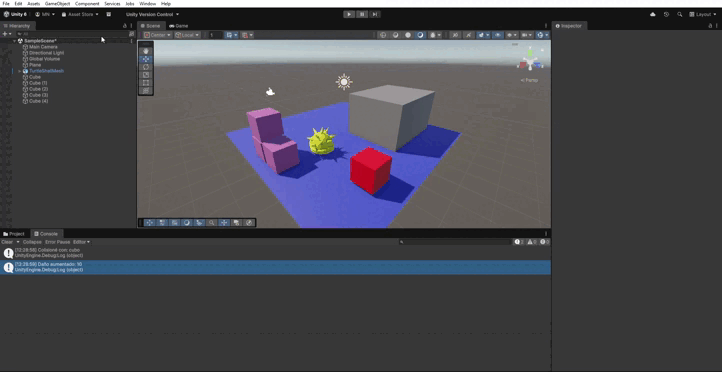

## Ejercicio-4

  Hemos creado tres tipos de objetos colocados en capas distintas: personaje, enemigos y recolectables, trasn onfigura la **Layer Collision Matrix** ahora los enemigos solo colisionan con el persojonaje y lo srecolectables son triggers que con el script **recolectar**.
  Desaparecen tras el jugador los "recolecta".

  Cuando un objeto entra en el trigger del recolectable, verifica si el objeto tiene el tag "personaje". Si es así, se muestra un mensaje en la consola indicando que el objeto fue recolectado y luego se destruye el objeto recolectable con Destroy(gameObject).

  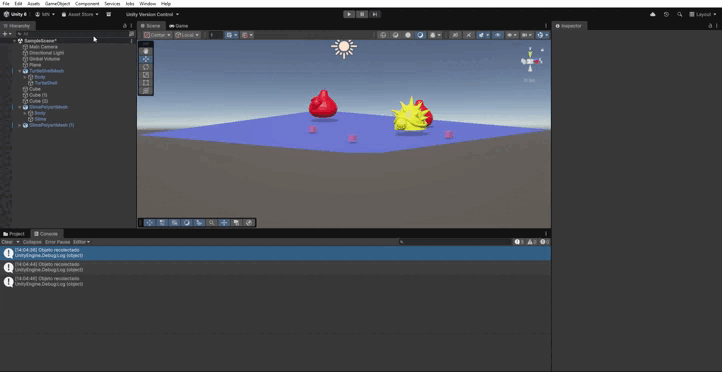

## Ejercicio-5
   En la escenas hemos puesto 3 cubos que tengan distintos materiales físicos, como resbaladizo, rugoso o con alto rebote. Aplica estos **Physic Materials** a los objetos y, al presionar la tecla **X**, lánzalos usando **AddForce()** para observar cómo varían sus reacciones según el material aplicado.

  El script **lanzarObjeto** permite lanzar un objeto con un **Rigidbody** al presionar la tecla X. En Start(), se obtiene el componente Rigidbody del objeto. Luego, en cada Update, se verifica si se ha presionado la tecla X, y si es así, se aplica una fuerza hacia arriba usando rb.AddForce(Vector3.up * fuerzaLanzamiento).

   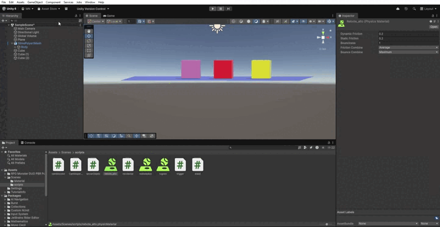
  
  

  
  

